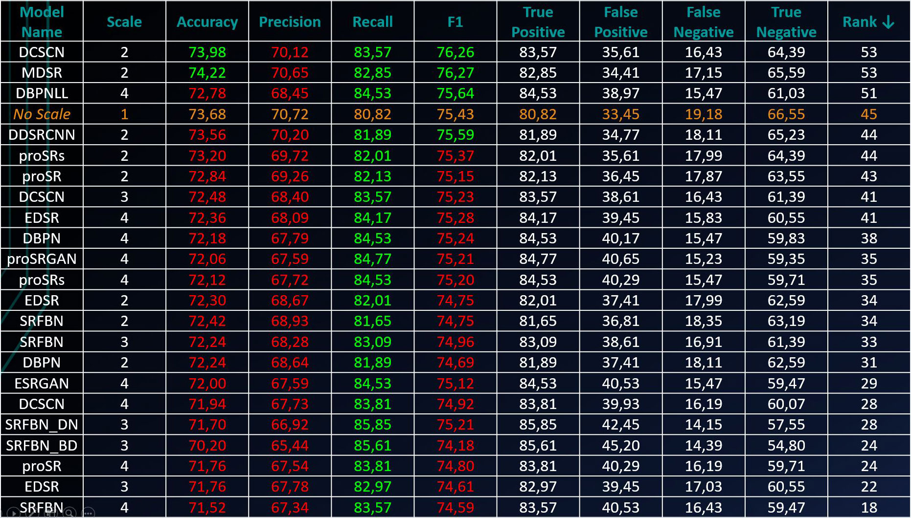

# **Person verification with Face Detection and Super-Resolution**

# Introduction
Suppose there are 2 photos of a person in front of us, and we need to determine if this is the same person. And we made a face verification algorithm that determines whether the same person is in the photos or not.
# Problem
We want to find out if it is possible to improve the quality of verification with the help of Super-Resolution techniques.  

Thus, **we want to confirm the hypothesis of whether it is possible to improve the quality of verification with the help of preliminary upscaling (applying Super-Resolution)**.

And we don't know which metric is best for us. Since this is a binary classification problem (1 - the same person on pair of pics, 0 - otherwise), we take `Accuracy`, `Precision`, `Recall`, `F1` and entire `Confusion Matrix` just in case.

# The way to achieve the result
We took [Labeled Faces in the Wild open dataset](http://vis-www.cs.umass.edu/lfw/) for our experiments. Then we made up 834 pairs of persons belonging to the same person, and 834 pairs of faces of different people. A total of 1,668 pairs - we thought that would be enough for a primary research. In addition, we did not have computational resources.

Then, we tested the verification algorithm on the obtained data, saved the results, and began to search through all the pre-trained Super-Resolution algorithms available to us (by configuration). Many of papers we managed to reproduce and run, but many, unfortunately, failed, for various reasons.

After receiving the images after applying the Super-Resolution, we apply the verification algorithm to them and put the obtained values ​​of the metrics into the benchmark.

Since we do not know which metric is most important to us, we introduce a new one - Rank, which shows Accuracy, Precision and Recall together.

There are no resulting images in the repository, if necessary, you can restore most of the results using [this](https://drive.google.com/drive/folders/1dgNBfAv1VsdX-TtKKnOD3jkf5EZuMXAu?usp=sharing), and then notebook's (`Whole pipeline.ipynb` and `Files fixes.ipynb`) from the repository.
# Result
**Benchmark clearly confirms the hypothesis.**  
The whole benchmark:

*Rank equals the sum of indices of Accuracy, Precision and Recall when sorting by them*  

In fact, the results on metrics are very interesting for further research.  
For a more complete research, a larger dataset and more models trained specifically on people's faces are needed.
# Papers and works used in research (only those that gave the result)
- https://github.com/ipazc/mtcnn <- https://arxiv.org/abs/1604.02878  
- https://github.com/jiny2001/dcscn-super-resolution <- https://arxiv.org/abs/1707.05425  
- https://github.com/thstkdgus35/EDSR-PyTorch <- https://arxiv.org/abs/1707.02921  
- https://github.com/alterzero/DBPN-Pytorch <- https://arxiv.org/abs/1803.02735  
- https://github.com/titu1994/Image-Super-Resolution <- https://arxiv.org/abs/1501.00092  
- https://github.com/fperazzi/proSR <- https://arxiv.org/abs/1804.02900  
- https://github.com/Paper99/SRFBN_CVPR19 <- https://arxiv.org/abs/1903.09814  
- https://github.com/xinntao/ESRGAN  

> Also big thanks to [papers with code](https://paperswithcode.com/task/image-super-resolution) for help in searching.
# Team members
> [Nikita Detkov](https://github.com/NikitiusD), [Ilya Liyasov](https://github.com/Literman), Tanya Vasilyeva
